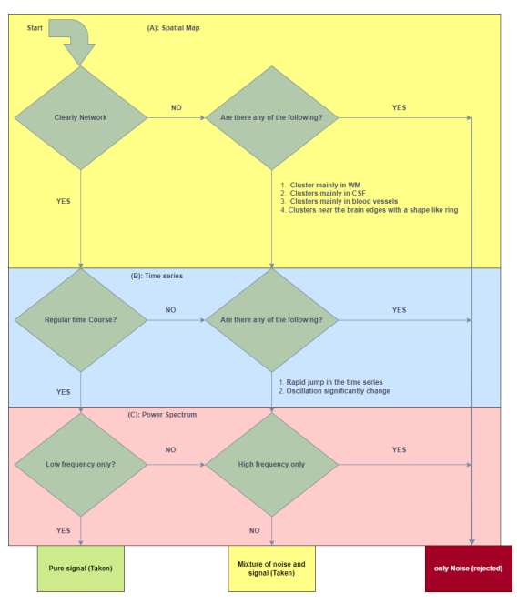

# fMRI-Denoising using Deep Learning
 
The objective of this project is to assess the effectiveness of a deep learning technique in classifying the fMRI data by determining whether independent components (ICs) are either signal or noise.Also, the results of this model was evaluated with ICA-AROMA and Manual labeling (manual labeling was also the target data for the model).

The above image clarify the model which has been used for the classification of the fMRI data. 

After the preprocessing steps, which could be done using [SPM](https://www.fil.ion.ucl.ac.uk/spm/) or [FSL](https://fsl.fmrib.ox.ac.uk/fsl/fslwiki/) or both together, you can use Independant Component Analysis (ICA), which could be easily done through FSL. The ICA step will decompose your data into independent components (ICs) which are 3D Spatial maps and 1D time series, those components will be fed to the model. I also suggest to use ICA-AROMA instead of just ICA because it can also classify the noise components that is related to  motion artefacts, so you can evaluate the results you obtain from your model with ICA-AROMA in the processing steps. 

If you are not an expert in classifying the fMRI components manually, I recommend you to have a look at the following flow chart.

Please, try to save your data into HDF5 file format, it will make things easier and this format is perfect for complex type of data such as fMRI.

CNN has been used due to its ability to automatically learn discriminative features deeply embedded in the data, resulting in accurate output generation. The CNN's advantage lies in its capacity to capture high-level contextual information from both local and global perspectives, incorporating non-linear relationships. Therefore, the CNN can be employed to extract meaningful spatial and temporal features from the IC spatial maps and associated time series, respectively. 
However, I strongly encourage you to try to use LSTM with the time series data instead of CNN, It may give you even better results. 

The model accuracy and AUC was about 80%, which are descent considering the limited amount of data I have. Also, after performing a statistical analysis, there were no statistically significant difference between the deep learning model, ICA-AROMA, and manual labelling as the alpha level , set at 0.05, was not satisfied. despite that, this reveal an advantage of deep learning over other techniques as it super fast and doesn't require prior experties.
