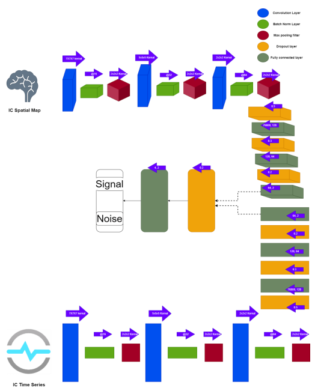

# fMRI-Denoising using Deep Learning
 
The objective of this project is to assess the effectiveness of a deep learning technique in classifying the fMRI data by determining whether independent components (ICs) are either signal or noise.

